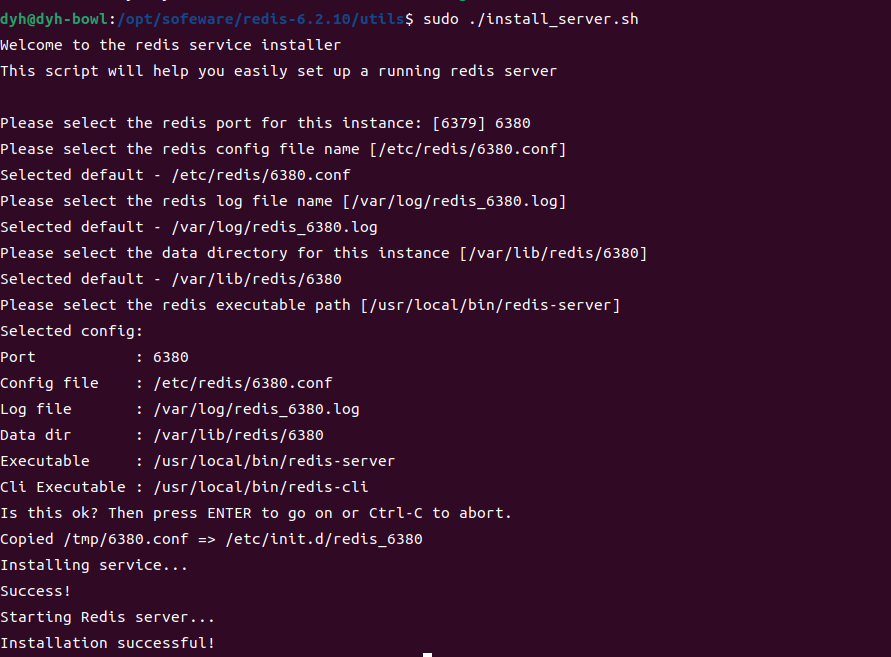

# 问题

## 1、如果数据库中一个表的数据量很大，性能会不会下降？

增删改操作会变慢，因为如果表中有索引，需要额外的维护索引，从而导致增删改变慢；

查询操作，如果是少量的查询性能不会下降，但是并发量大的时候，如果查询的数据都分布再不同的4k上，磁盘IO就会成为瓶颈，导致查询变慢；

## 2、Memcached为什么会被redis给替代？

memcached仅支持string类型的key-value存储，而redis中是类型的该类的，重要的是redis对这些类型的有丰富的操作支持，客户端的代码就变的简洁轻盈（优势：计算向数据移动）。

|            | Memcached                                       | Redis                                           |
| :--------- | :---------------------------------------------- | ----------------------------------------------- |
| 线程模型   | 多线程                                          | 单线程                                          |
| 数据结构   | 仅支持string、value最大1M、过期时间不能超过30天 | string、list、hash、set、zset、geo、hyperLogLog |
| 淘汰策略   | LRU                                             | LRU、LFU、随机等多种策略                        |
| 管道与事务 | 不支持                                          | 支持                                            |
| 持久化     | 不支持                                          | 支持                                            |
| 高可用     | 不支持                                          | 主从复制+哨兵                                   |
| 集群化     | 客户端一致性哈希算法                            | 主从复制+哨兵+固定哈希槽位                      |

整体来说，Redis提供了非常丰富的功能，而且性能基本上与Memcached相差无几，这也是它最近这几年占领内存数据库鳌头的原因。	

## 3、kafak客户端自动提交offset问题

代码开启自动提交offset是异步操作提交，就可能会发生丢失数据/重复消费数据

> **代码控制问题，offset持久化了，业务执行出错，可能造成数据丢失**
>
> **异步处理，先干活，后持久化offset，可能造成重复消费**